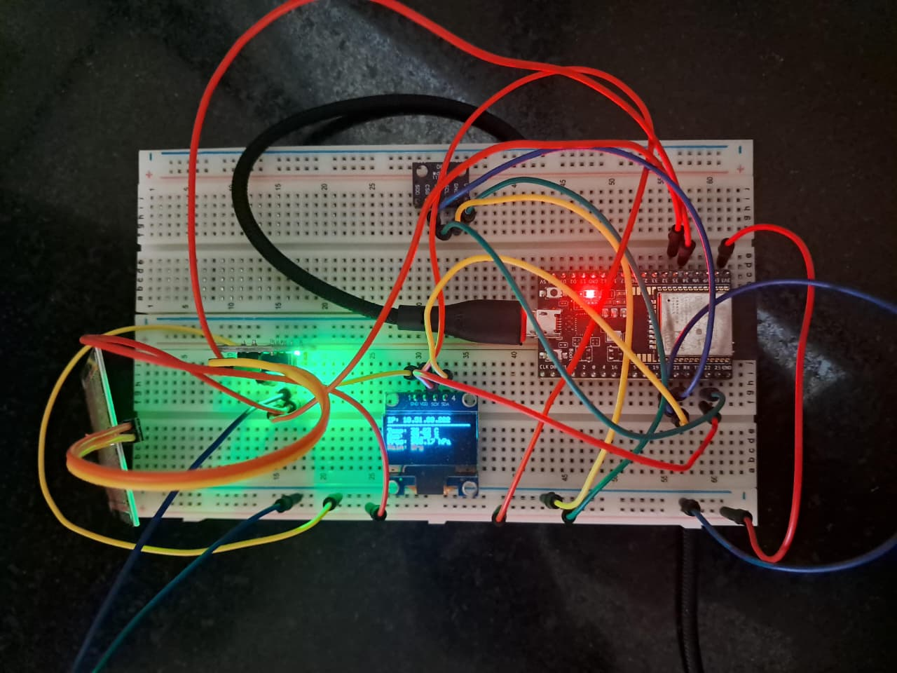

# ESP32-Weather-Station
An ESP32-based local weather station using a BME280 sensor, rain sensor, and OLED display
# ESP32 Localized Weather Station



An embedded IoT weather monitoring system built around the ESP32 microcontroller. This project captures real-time environmental data—including temperature, humidity, atmospheric pressure, and precipitation levels—and serves it concurrently to a local web interface and an onboard OLED display. 

Designed with a focus on non-blocking software architecture, the system ensures a highly responsive asynchronous web server while maintaining accurate, fixed-interval sensor polling.

## ⚙️ System Architecture & Complexities

This project moves beyond basic procedural scripts by implementing several robust embedded systems concepts:

### 1. Dual-Mode Precipitation Sensing
To achieve both immediate event detection and granular intensity tracking, the system utilizes both the Analog to Digital Converter (ADC) and digital GPIO pins simultaneously from the raindrop module:
* **Digital Status (`GPIO 35`):** Acts as a hardware-level comparator, instantly flagging a binary "Raining" or "Dry" state based on a tunable physical potentiometer threshold.
* **Analog Intensity (`GPIO 34`):** Reads the raw 12-bit ADC value (0-4095) from the sensor's voltage divider. This raw data is then mathematically mapped and constrained into a clean 0-100% intensity metric for the user interface.

### 2. Non-Blocking Event Loop (State Management)
Instead of utilizing standard `delay()` functions which halt the CPU, the system relies on hardware timer comparisons (`millis()`). This ensures the ESP32's core is continuously free to handle incoming HTTP requests (`server.handleClient()`), making the web server highly responsive without interrupting the 2000ms interval required for I2C sensor polling.

### 3. I2C Bus Integration
The system efficiently manages an I2C bus sharing the `SDA` and `SCL` lines between two completely different peripherals with discrete addresses:
* **BME280 Environmental Sensor** (Address `0x76`)
* **SSD1306 0.96" OLED Display** (Address `0x3C`)

## 🛠️ Hardware Requirements

* **Microcontroller:** ESP32 Development Board
* **Sensors:** 
  * BME280 (Temperature, Humidity, Pressure)
  * Raindrop Sensor Module (Analog + Digital out)
* **Display:** 0.96" SSD1306 OLED (128x64)
* **Miscellaneous:** Breadboard, Jumper Wires

## 🔌 Pin Mapping

| Peripheral | ESP32 Pin | Function |
| :--- | :--- | :--- |
| **BME280 & OLED** | `GPIO 21` | I2C SDA |
| **BME280 & OLED** | `GPIO 22` | I2C SCL |
| **Rain Sensor** | `GPIO 34` | Analog In (ADC) for Rain Intensity |
| **Rain Sensor** | `GPIO 35` | Digital In for Rain Threshold Status |

## 🚀 Setup & Installation

1. **Clone the Repository:**
   ```bash
   git clone [https://github.com/yourusername/esp32-weather-station.git](https://github.com/yourusername/esp32-weather-station.git)
